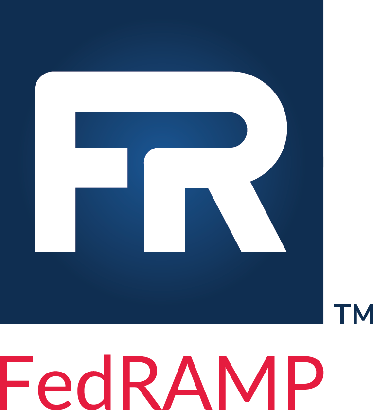

 
# Federal Risk and Authorization Management Program (FedRAMP) Automation
### Based on the Open Security Controls Assessment Language (OSCAL)

## February 25, 2021

**Guides and Templates updated to OSCAL Release Candidate #2 (RC-2) Syntax**

The FedRAMP Program Management Office (PMO) has drafted FedRAMP-specific extensions and guidance to ensure our stakeholders can fully express a FedRAMP Security Authorization Package using NIST's [OSCAL SSP syntax](https://pages.nist.gov/OSCAL/documentation/).

To accompany these guides, the FedRAMP PMO has also drafted OSCAL files in XML and JSON formats to serve as an example and template for each major deliverable.

## We Want Your Feedback!

The FedRAMP PMO is releasing the following files for public review and comment:
- **FedRAMP OSCAL Registry (Updated):** This registry is the authoritative source for all FedRAMP extensions to the OSCAL syntax, FedRAMP-defined identifiers, and accepted values. The draft for public comment is available [here](./documents/FedRAMP_Extensions.pdf).

- **Implementation Guides:** These documents enables tool developers to generate OSCAL-based FedRAMP deliverabes that are fully compliant with FedRAMP’s extensions, defined identifiers, conformity tags, and acceptable values. The drafts for public comment are available [here](./documents/).

- **OSCAL-based FedRAMP Templates:** The template files are pre-populated with FedRAMP extensions, defined-identifiers, and conformity tags where practical. They also include sample data, and are the basis for their respective guidance documents above. The drafts for public comment are available in both XML and JSON formats [here](./templates/).

- **FedRAMP Baselines (Updated):** The FedRAMP baselines for High, Moderate, Low, and Tailored for Low Impact-Software as a Service (LI-SaaS) in OSCAL (XML and JSON formats) are available [here](./baselines). 

Please ask questions or provide feedback on the items above above either via email to [info@fedramp.gov](mailto:info@fedramp.gov), as a comment to an existing [issue](https://github.com/GSA/fedramp-automation/issues), or as a new [issue](https://github.com/GSA/fedramp-automation/issues).

## Dependencies

FedRAMP's work is based on NIST's [OSCAL 1.0.0-Milestone3 release](https://github.com/usnistgov/OSCAL/releases/tag/v1.0.0-milestone3), and requires an understanding of the core OSCAL syntax, as well as NIST-provided resources to function correctly.

**IMPORTANT**: NIST has made minor syntax updates since releasing Mielstone 3, which are also reflected in these guides. The most notable are changes to the POA&M syntax, which renamed "results" to "poam-items" and "finding" to "poam-item".

The following NIST resources are available:
- **NIST's Main OSCAL Site:** [https://pages.nist.gov/OSCAL/](https://pages.nist.gov/OSCAL/)

- **NIST's OSCAL GitHub Repository:** [https://github.com/usnistgov/OSCAL](https://github.com/usnistgov/OSCAL)

- **OSCAL Workshop Training Slides:** Provided at an October workshop hosted by the NIST OSCAL Team. The early portions of the deck provide an overview, with more technical details beginning on slide 52. [https://pages.nist.gov/OSCAL/downloads/OSCAL-workshop-20191105.pdf](https://pages.nist.gov/OSCAL/downloads/OSCAL-workshop-20191105.pdf)

- **Content Converters:** The converters accurately convert OSCAL catalog, profile, SSP, SAP, SAR, and POA&M content from [XML to JSON](https://github.com/usnistgov/OSCAL/tree/master/json/convert) and [JSON to XML](https://github.com/usnistgov/OSCAL/tree/master/xml/convert). 

- **NIST SP 800-53 & 53A Revision 4 in OSCAL:** NIST is also providing SP 800-53 and 800-53A, Revision 4 content as well as the NIST High, Moderate, and Low baselines in OSCAL (XML, JSON, and YAML formats) [here](https://github.com/usnistgov/OSCAL/tree/master/content/nist.gov/SP800-53/rev4). 

NIST offers a complete package containing the NIST OSCAL converters, syntax validation tools, 800-53 and FedRAMP baselines content is available for download in both [ZIP](https://github.com/usnistgov/OSCAL/releases/download/v1.0.0-milestone3/oscal-1.0.0-milestone3.zip) and [BZ2](https://github.com/usnistgov/OSCAL/releases/download/v1.0.0-milestone3/oscal-1.0.0-milestone3.tar.bz2) formats. 

Please ask questions or provide feedback on the above NIST dependencie either via email to [oscal@nist.gov](mailto:oscal@nist.gov), as a comment to an existing issue, or as a new issue via the [NIST OSCAL GitHub site](https://github.com/usnistgov/OSCAL/issues).

### FedRAMP looks forward to receiving your comments and sharing additional progress.

