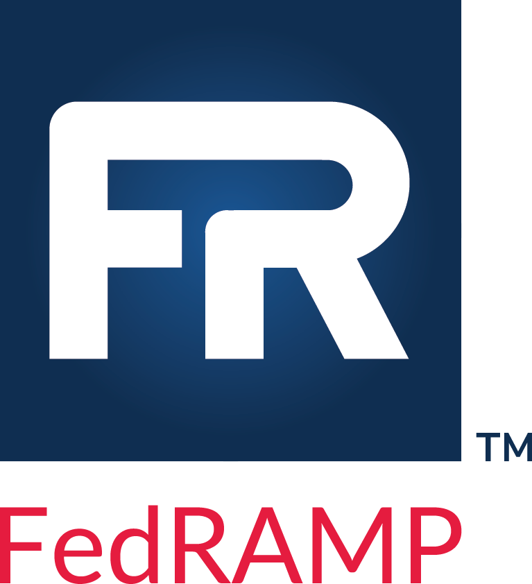

 
# Federal Risk and Authorization Management Program (FedRAMP) Automation Guides
### Based on the Open Security Controls Assessment Language (OSCAL)

This includes the following content:

- **[Guide to OSCAL-based FedRAMP Content](./Guide_to_OSCAL-based_FedRAMP_Content.pdf)** [START HERE]

- **[Guide to OSCAL-based FedRAMP System Security Plans (SSP)](./Guide_to_OSCAL-based_FedRAMP_System_Security_Plans_(SSP).pdf)**

- **[Guide to OSCAL-based FedRAMP Security Assessment Plans (SAP)](./Guide_to_OSCAL-based_FedRAMP_Security_Assessment_Plans_(SAP).pdf)**

- **[Guide to OSCAL-based FedRAMP Security Assessment Reports (SAR)](./Guide_to_OSCAL-based_FedRAMP_Security_Assessment_Reports_(SAR).pdf)**

- **[Guide to OSCAL-based FedRAMP Plan of Action and Milestones (POA&M)](./Guide_to_OSCAL-based_FedRAMP_Plan_of_Action_and_Milestones_(POAM).pdf)**

**NOTE: The FedRAMP OSCAL Registry is now a machine-readable file using the DRAFT NIST OSCAL Extensions Model**
- [xml](../resources/xml/FedRAMP_extensions.xml)
- [json](../resources/json/FedRAMP_extensions.json)
- [html](./FedRAMP_extensions.html)
- [pdf](./FedRAMP_extensions.pdf)

- **[FedRAMP OSCAL Vendor Resource Summary](./FedRAMP_OSCAL_Vendor_Resources.pdf)**

