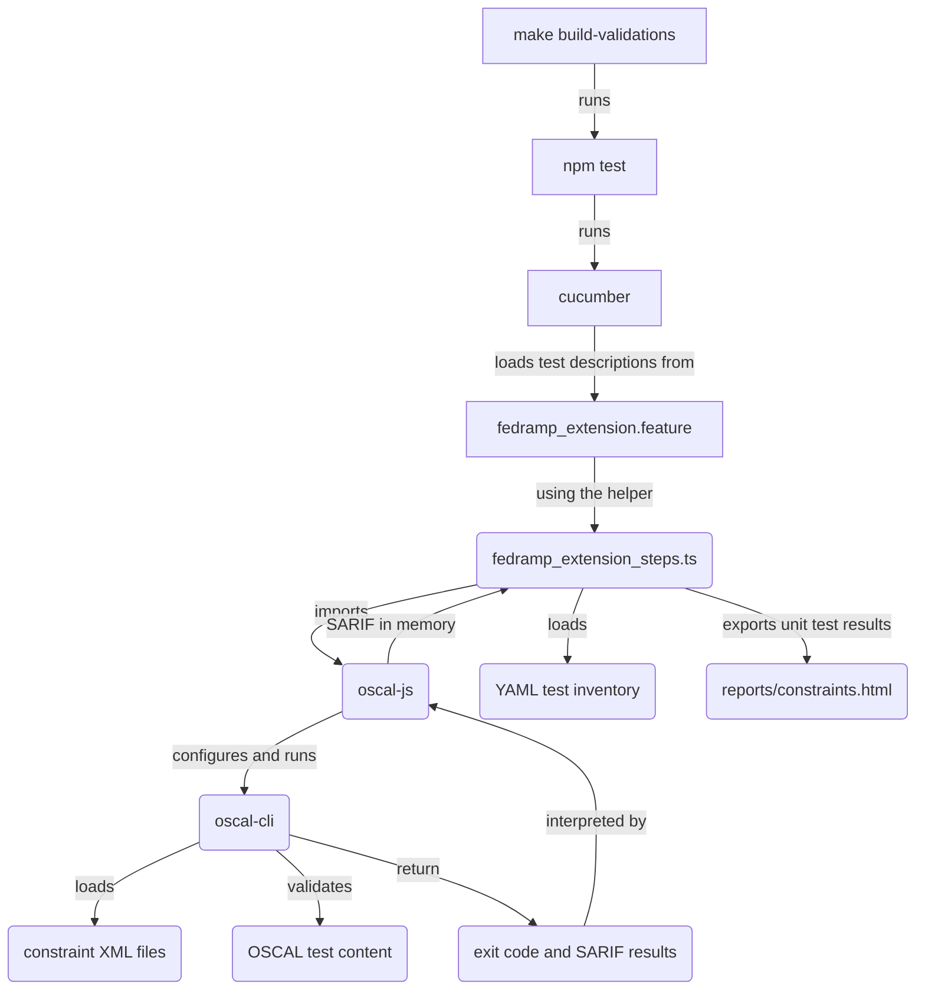

# Contributing to constraints and tests

This area of the codebase has the constraints to check FedRAMP requirements for OSCAL data and a test harness. The test harness includes unit tests, valid, and invalid OSCAL fixture data for those tests.

## Overview of the constraint and testing infrastructure

The diagram below highlights how different parts of the development and testing infrastructure function to test FedRAMP constraints on valid and invalid OSCAL test data.



## How do I install tools for development and testing?

After you [install the prerequisites](./README.md#31-prerequisites), you can use `make` to properly configure tools and their dependencies.

```sh
cd path/to/fedramp-automation
make init
```

## How do I run the tests?

To run the existing tests as-is, you can use `make` or `npm` directly.

```sh
cd path/to/fedramp-automation
# use make
make test
# or use npm from the top-level directory
npm test
# or use it from within this directory
cd src/validations/constraints
npm test
```

## How do I modify a test?

## How do I add a constraint and test?

## How do I delete a constraint and test?
