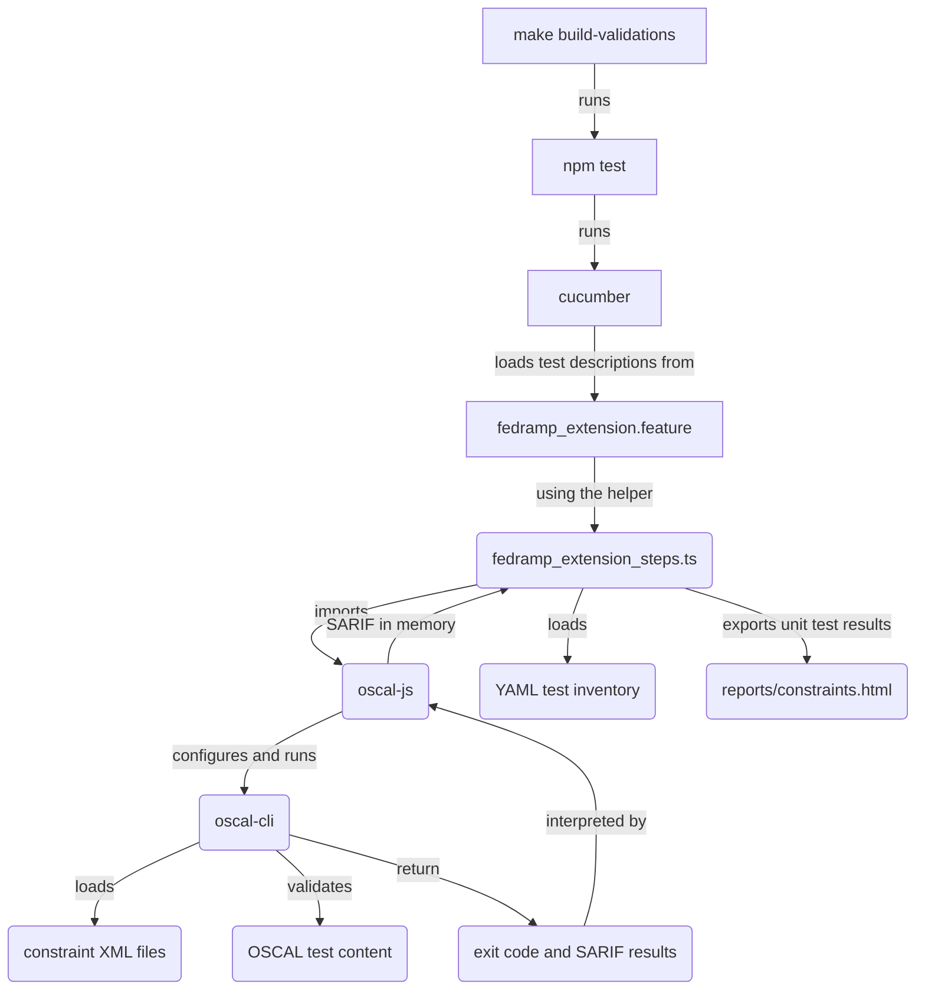

# Contributing to constraints and tests

This area of the codebase has the constraints to check FedRAMP requirements for OSCAL data and a test harness. The test harness includes unit tests, valid, and invalid OSCAL fixture data for those tests.

## Overview of the constraint and testing infrastructure

The diagram below highlights how different parts of the development and testing infrastructure function to test FedRAMP constraints on valid and invalid OSCAL test data.



## How do I install tools for development and testing?

After you [install the prerequisites](./README.md#31-prerequisites), you can use `make` to properly configure tools and their dependencies.

```sh
cd path/to/fedramp-automation
make init
```

## How do I run the tests?

To run the existing tests as-is, you can use `make` or `npm` directly.

```sh
cd path/to/fedramp-automation
# use make
make test
# or use npm from the top-level directory
npm test
# or use it from within this directory
cd src/validations/constraints
npm test
```

## How do I add a constraint and test?

You can add a constraint and test to this repository by following these high-level steps.

1. Create a new constraint in [the appropriate constraints file](#which-constraint-file-do-i-edit). Note the `id`, you will use it later.
2. Add the necessary, correct data to [`./content/ssp-all-VALID.xml`](./content/ssp-all-VALID.xml) for a positive test of the constraint.
3. Add the YAML metadata for the positive test in [`./unit-tests`](./unit-tests/). The name of the file should start with the name of the assembly, field, or flag, and end with `-PASS.yaml`. For example, a new constraint and test for a [`//metadata/party/prop`](https://pages.nist.gov/OSCAL-Reference/models/v1.1.2/system-security-plan/json-reference/#/system-security-plan/metadata/parties) assembly should be `party-PASS.yaml`. The content should be like the example below.

```yaml
# ./unit-tests/party-PASS.yaml
test-case:
  name: Positive Test for party
  description: This test case validates the behavior of constraint party
  content: ../content/ssp-all-VALID.xml
  expectations:
    - constraint-id: party
      result: pass
```

4. Add the necessary, incorrect data to [`./content/ssp-all-INVALID.xml`](./content/ssp-all-INVALID.xml) for a positive test of the constraint.
5. Add the YAML metadata for the negative test in [`./unit-tests`](./unit-tests/). The name of the file should start with the name of the assembly, field, or flag, and end with `-FAIL.yaml`. For example, a new constraint and test for a `//metadata/party/prop` assembly should be `party-FAIL.yaml`. The content should be like the example below.

```yaml
# ./unit-tests/party-FAIL.yaml
test-case:
  name: Negative Test for party
  description: This test case validates the behavior of constraint party
  content: ../content/ssp-all-INVALID.xml
  expectations:
    - constraint-id: party
      result: fail
```

6. Update the test descriptions in [Cucumber feature file](https://cucumber.io/docs/gherkin/reference/), [`../../../features/fedramp_extensions.feature`](../../../features/fedramp_extensions.feature). Add the file names between `#BEGIN_DYNAMIC_TEST_CASES` and `#END_DYNAMIC_TEST_CASES` blocks in alphabetical order so the test runner discovers them. Add the constraint ID between the `#BEGIN_DYNAMIC_CONSTRAINT_IDS` and `#END_DYNAMIC_CONSTRAINT_IDS` in alphabetical order so the test runner can perform code coverage analysis. The updated content should like the example below.

```yaml
# Beginning of file truncated
#BEGIN_DYNAMIC_TEST_CASES
# There will be existing test case files, you are adding these below
  | party-FAIL.yaml |
  | party-PASS.yaml |
#END_DYNAMIC_TEST_CASES
# Middle of file truncated
#BEGIN_DYNAMIC_CONSTRAINT_IDS
# There will be existing constraint IDs, you are adding this one below
  | party |
#END_DYNAMIC_CONSTRAINT_IDS
# End of file truncated
```

7. You can now [run the test harness](#how-do-i-run-the-tests) and confirm the new tests are correct.

## How do I modify a test?

## How do I delete a constraint and test?

## Which constraint file do I edit?

### `fedramp-external-allowed-values.xml`

### `fedramp-external-constraints.xml`

### `oscal-external-constraints.xml`

## How do I learn more about Metaschema and Metapath?

To add or modify constraints and their tests, it is important to understand Metaschema syntax, particularly constraint syntax and Metapath syntax for `@test` and `@target` in the constraints. You can review these pages for more information.

- [Metaschema constraint syntax](https://pages.nist.gov/metaschema/specification/syntax/constraints/)
- [Metapath expression language](https://pages.nist.gov/metaschema/specification/syntax/metapath/)
- [Metaschema tutorials for modeling and constraints](https://pages.nist.gov/metaschema/tutorials/)
- [Metaschema complete syntax reference](https://pages.nist.gov/metaschema/specification/syntax/)
