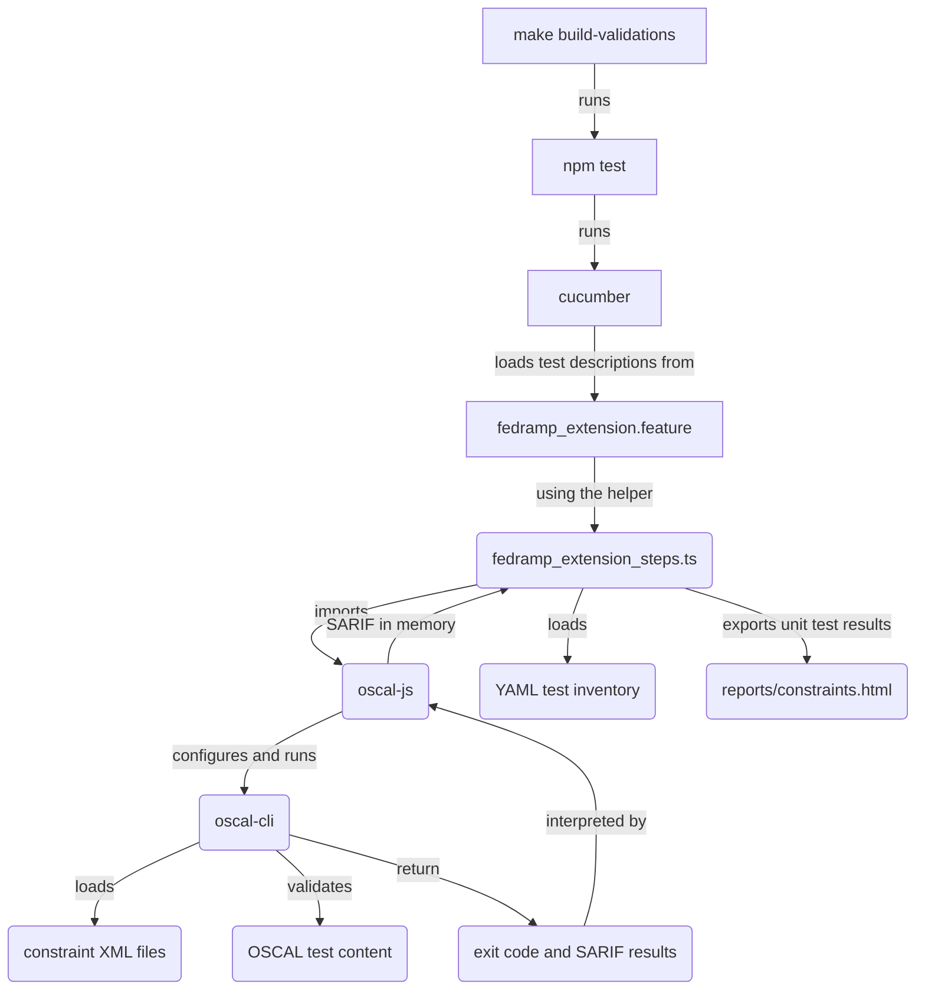

# Contributing to constraints and tests

This document guides developers through changing or extending code and data in in this folder and sub-folders. They contain the constraints to check FedRAMP requirements for OSCAL data and a test harness. The test harness includes unit tests, valid, and invalid OSCAL fixture data for those tests.
Before contributing to this portion of the codebase, please review the and follow the guidance in the [project contribution page](../../../CONTRIBUTING.md).
## Overview of the constraint and testing infrastructure

The diagram below highlights how different constraints, tests, fixture data with invalid and valid OSCAL documents, and dependencies function together.



## How do I install tools for development and testing?

After you [install the prerequisites](./README.md#31-prerequisites), you can use `make` to properly configure tools and their dependencies.

```sh
cd path/to/fedramp-automation
make init
```

If you prefer container-based development and testing, you can build the container and mount the development data into the container.

```sh
cd path/to/fedramp-automation
make build-oci-image
```

Alternatively, you can download pre-built container images. You can also download the latest stable release with the example command below.

```sh
docker pull ghcr.io/gsa/fedramp-automation/validation-tools:latest
```

Review pre-release builds based on tags with IDs for commits from the `develop` branch or specific pull request branches by checking [image tags of published images](https://github.com/GSA/fedramp-automation/pkgs/container/fedramp-automation%2Fvalidation-tools/versions). For example, you can download the container image with tag `f6d200916d19c87fb56c1d08e905fb9d2c2ced4f`, built from source code changed with [commit `f6d200916d19c87fb56c1d08e905fb9d2c2ced4f`](https://github.com/GSA/fedramp-automation/tree/f6d200916d19c87fb56c1d08e905fb9d2c2ced4f), with the example command below.

```sh
docker pull ghcr.io/gsa/fedramp-automation/validation-tools:f6d200916d19c87fb56c1d08e905fb9d2c2ced4f
```

Once you install the container image, you can run the container and mount the local copy of the git repository for new constraints and test infrastructure. An example command using the development version of constraints with the tooling, not the preinstalled ones from a pre-existing container, is below.

```sh
docker run --rm -it \
  -v $(PWD):/data \
  ghcr.io/gsa/fedramp-automation/validation-tools \
  validate \
  '/data/src/content/awesome-cloud/xmlAwesomeCloudSSP1.xml' \
  -c '/data/src/validations/constraints/fedramp-external-allowed-values.xml' \
  -c '/data/src/validations/constraints/fedramp-external-constraints.xml'
```

Observe the full paths to identify the location of pre-release constraint files. This use of a container allows you to use pre-installed utilities and your work in development.

You may also directly run commands in the container by using an explicit entrypoint to the shell `/bin/sh` and not run the default `oscal-cli` entrypoint with your command arguments. An example is below.

```sh
docker run --rm -it \
  -v $(PWD):/data \
  --entrypoint /bin/sh \
  ghcr.io/gsa/fedramp-automation/validation-tools
```

## How do I run the tests?

To run the existing tests as-is, you can use `make` or `npm` directly.

```sh
cd path/to/fedramp-automation
# use make
make test
# or use npm from the top-level directory
npm test
# or use it from within this directory
cd src/validations/constraints
npm test
```

## How do I run the tests for a specific constraint?

To run tests for a specific constraint or a selection of several constraints, you can use `npm run` as follows.

```sh
cd path/to/fedramp-automation
# to test a constraint with the ID <my-constraint-id>
npm run constraint <my-constraint-id>

# to get a list of one or more constraints to select for testing
npm run constraint 
## How do I add a constraint and test?

You can add a constraint and test to this repository by following these high-level steps.

1. Create a new constraint in [the appropriate constraints file](#which-constraint-file-do-i-edit). Note the `id`, you will use it later.
2. Add the necessary, correct data to [`./content/ssp-all-VALID.xml`](./content/ssp-all-VALID.xml) for a positive test of the constraint.
3. Add the YAML metadata for the positive test in [`./unit-tests`](./unit-tests/). The name of the file should start with the name of the assembly, field, or flag, and end with `-PASS.yaml`. For example, a new constraint and test for a [`//metadata/party/prop`](https://pages.nist.gov/OSCAL-Reference/models/v1.1.2/system-security-plan/json-reference/#/system-security-plan/metadata/parties) assembly should be `party-PASS.yaml`. The content should be like the example below.

```yaml
# ./unit-tests/party-PASS.yaml
test-case:
  name: Positive Test for party
  description: This test case validates the behavior of constraint party
  content: ../content/ssp-all-VALID.xml
  expectations:
    - constraint-id: party
      result: pass
```

4. Add the necessary, incorrect data to [`./content/ssp-all-INVALID.xml`](./content/ssp-all-INVALID.xml) for a positive test of the constraint.
5. Add the YAML metadata for the negative test in [`./unit-tests`](./unit-tests/). The name of the file should start with the name of the assembly, field, or flag, and end with `-FAIL.yaml`. For example, a new constraint and test for a `//metadata/party/prop` assembly should be `party-FAIL.yaml`. The content should be like the example below.

```yaml
# ./unit-tests/party-FAIL.yaml
test-case:
  name: Negative Test for party
  description: This test case validates the behavior of constraint party
  content: ../content/ssp-all-INVALID.xml
  expectations:
    - constraint-id: party
      result: fail
```

6. Update the test descriptions in [Cucumber feature file](https://cucumber.io/docs/gherkin/reference/), [`../../../features/fedramp_extensions.feature`](../../../features/fedramp_extensions.feature). Add the file names between `#BEGIN_DYNAMIC_TEST_CASES` and `#END_DYNAMIC_TEST_CASES` blocks in alphabetical order so the test runner discovers them. Add the constraint ID between the `#BEGIN_DYNAMIC_CONSTRAINT_IDS` and `#END_DYNAMIC_CONSTRAINT_IDS` in alphabetical order so the test runner can perform code coverage analysis. The updated content should like the example below.

```yaml
# Beginning of file truncated
#BEGIN_DYNAMIC_TEST_CASES
# There will be existing test case files, you are adding these below
  | party-FAIL.yaml |
  | party-PASS.yaml |
#END_DYNAMIC_TEST_CASES
# Middle of file truncated
#BEGIN_DYNAMIC_CONSTRAINT_IDS
# There will be existing constraint IDs, you are adding this one below
  | party |
#END_DYNAMIC_CONSTRAINT_IDS
# End of file truncated
```

7. You can now [run the test harness](#how-do-i-run-the-tests) and confirm the new tests are correct.
8. Update the files with [`git add`](https://git-scm.com/docs/git-add) and [`git commit`](https://git-scm.com/docs/git-commit) to a branch for a pull request [that follows our guidance](../../../CONTRIBUTING.md#contributing-to-this-github-repository).

## How do I modify a test?

To modify a test, you may possibly need to change the constraint, valid test data, invalid test data, the test case YAML file(s), and the Cucumber inventory.

To change the test data for a test developers [previously added with the correct steps](#how-do-i-add-a-constraint-and-test), you only need to modify the valid or invalid data in [`./content`](./content).

To change the `test` or `target` of a constraint developers [previously added with the correct steps](#how-do-i-add-a-constraint-and-test), you may only need to adjust the constraint [in the appropriate constraint file](#which-constraint-file-do-i-edit), the valid data, and/or invalid data, but not other files. What and why you will change determines if some or all those files need a modification.

To change the `id` of a constraint developers [previously added with the correct steps](#how-do-i-add-a-constraint-and-test), you must make more changes.

1. You must update the `id` [in the appropriate constraint file](#which-constraint-file-do-i-edit).
1. You must use [`git mv`](https://git-scm.com/docs/git-mv) to rename the test case files in [`./unit-tests`](./unit-tests) with relevant changes to the assembly, field, or flag and ID.
1. You must update the files names and constraint ID in [`../../../features/fedramp_extensions.feature`](../../../features/fedramp_extensions.feature) accordingly.
1. Update the files with [`git add`](https://git-scm.com/docs/git-add) and [`git commit`](https://git-scm.com/docs/git-commit) to a branch for a pull request [that follows our guidance](../../../CONTRIBUTING.md#contributing-to-this-github-repository)..

## How do I delete a constraint and test?

1. You must use [`git rm`](https://git-scm.com/docs/git-rm) to delete the relevant test case files in [`./unit-tests`](./unit-tests).
1. You must remove the relevant files names and constraints by their ID in [`../../../features/fedramp_extensions.feature`](../../../features/fedramp_extensions.feature) accordingly. Use [`git add`](https://git-scm.com/docs/git-add) with this file to record the deleted lines of the file.
1. You must remove the constraints by their ID in one or more of the relevant [constraint files](#which-constraint-file-do-i-edit) and use [`git add`](https://git-scm.com/docs/git-add) to record the deleted lines of the file.
1. Update the files with [`git commit`](https://git-scm.com/docs/git-commit) to a branch for a pull request [that follows our guidance](../../../CONTRIBUTING.md#contributing-to-this-github-repository).

## Which constraint file do I edit?

### `fedramp-external-allowed-values.xml`

The [`fedramp-external-allowed-values.xml`](./fedramp-external-allowed-values.xml) file contains [Metaschema constraints](#how-do-i-learn-more-about-metaschema-and-metapath) specific to FedRAMP use cases and requirements for data in the OSCAL information model. Specifically, developers only maintain constraints in this file if they are simple [`allowed-values` checks](https://pages.nist.gov/metaschema/specification/syntax/constraints/#allowed-values-constraints). FedRAMP developers maintain constraints of all types in the [`fedramp-external-constraints.xml`](#fedramp-external-constraintsxml) file.

### `fedramp-external-constraints.xml`

The [`fedramp-external-constraints.xml`](./fedramp-external-constraints.xml) file contains [Metaschema constraints](#how-do-i-learn-more-about-metaschema-and-metapath) specific to FedRAMP use cases and requirements for data in the OSCAL information model. Specifically, developers maintain all constraints in this file that are *not* simple [`allowed-values` checks](https://pages.nist.gov/metaschema/specification/syntax/constraints/#allowed-values-constraints).

### `oscal-external-constraints.xml`

The [`oscal-external-constraints.xml`](./oscal-external-constraints.xml) file contains [Metaschema constraints](#how-do-i-learn-more-about-metaschema-and-metapath) that can complement the existing constraints [embedded directly into the official upstream NIST OSCAL models](https://github.com/usnistgov/OSCAL/tree/v1.1.2/src/metaschema). The proposed constraints in this file support improved long-term maintenance and extensibility with the intent to merge upstream. Therefore, FedRAMP developers do *not* use this file for any constraint specific to FedRAMP use cases or requirements in the OSCAL information model.

**NOTE**: The FedRAMP Automation Team will make a best effort attempt to collaborate with NIST maintainers to merge them upstream and deprecate from this repository accordingly. Until further notice, the FedRAMP Automation Team maintains them here for testing and evaluation until they are sufficiently mature to contribute them upstream.


## How do I interactively run Metapath queries for constraint development?

The `mq` command is a utility for querying OSCAL content using Metapath expressions. It's useful for testing and debugging Metapath expressions used in constraints. To use the `mq` command:

1. Navigate to the project root directory.
2. Run the following npm command:

```sh
npm run mq
```

4. You'll be asked to enter the Metapath expression you want to query.
3. Next, you will be prompted to select an XML file to query against from the `src/validations/constraints/content` directory.

Alternatively, you can provide the Metapath expression and optionally the content file as command-line arguments:

```sh
npm run mq "<metapath-expression>" [<content-file>]
```

For example:

```sh
npm run mq "//party"
```

This command will evaluate the given Metapath expression against the selected (or specified) OSCAL content file and display the results.

## How do I learn more about Metaschema and Metapath?

To add or modify constraints and their tests, it is important to understand Metaschema syntax, particularly constraint syntax and Metapath syntax for `@test` and `@target` in the constraints. You can review these pages for more information.

- [Metaschema constraint syntax](https://pages.nist.gov/metaschema/specification/syntax/constraints/)
- [Metapath expression language](https://pages.nist.gov/metaschema/specification/syntax/metapath/)
- [Metaschema tutorials for modeling and constraints](https://pages.nist.gov/metaschema/tutorials/)
- [Metaschema complete syntax reference](https://pages.nist.gov/metaschema/specification/syntax/)

## Troubleshooting

### Enabling stack traces with `--show-stack-trace`

See [this information](./README.md#debugging-details-of-unexpected-failures-with---show-stack-trace) on how to use `--show-stack-trace` for debugging info to troubleshoot unexpected failures.

### Common causes and resolutions for unexpected failures

Below is a list of common cases of unexpected failures. If an unexpected failure is in this list below, it is expected behavior unless otherwise noted. Each entry should have guidance on how to resolve the underlying issue so constraints and tools can successfully complete validation.

#### org.xml.sax.SAXParseException

This unexpected failure or similar ones indicate a case where you used the `oscal-cli` tool and constraints to validate an otherwise valid OSCAL XML document, but did not properly escape special syntax characters in XML as required (i.e. `&`; `<`; `>`). Below is an example.

```sh
docker run --rm -it \
  -v $(PWD):/data \
  ghcr.io/gsa/fedramp-automation/validation-tools \
  validate \
  '/data/AwesomeCloudSSP1.xml' \
  --show-stack-trace
Validating 'file:/data/AwesomeCloudSSP1.xml' as XML.
Unexpected failure during validation of 'file:/data/AwesomeCloudSSP1.xml'
java.io.IOException: Unexpected failure during validation of 'file:/data/AwesomeCloudSSP1.xml'
        at gov.nist.secauto.metaschema.core.model.validation.XmlSchemaContentValidator.validate(XmlSchemaContentValidator.java:92) ~[dev.metaschema.java.metaschema-core-1.0.2.jar:?]
        at gov.nist.secauto.metaschema.core.model.validation.AbstractContentValidator.validate(AbstractContentValidator.java:27) ~[dev.metaschema.java.metaschema-core-1.0.2.jar:?]
        at gov.nist.secauto.metaschema.databind.IBindingContext$ISchemaValidationProvider.validateWithSchema(IBindingContext.java:473) ~[dev.metaschema.java.metaschema-databind-1.0.2.jar:?]
        at gov.nist.secauto.metaschema.cli.commands.AbstractValidateContentCommand$AbstractValidationCommandExecutor.execute(AbstractValidateContentCommand.java:250) ~[dev.metaschema.java.metaschema-cli-1.0.2.jar:?]
        at gov.nist.secauto.metaschema.cli.processor.CLIProcessor$CallingContext.invokeCommand(CLIProcessor.java:405) ~[dev.metaschema.java.cli-processor-1.0.2.jar:?]
        at gov.nist.secauto.metaschema.cli.processor.CLIProcessor$CallingContext.processCommand(CLIProcessor.java:376) [dev.metaschema.java.cli-processor-1.0.2.jar:?]
        at gov.nist.secauto.metaschema.cli.processor.CLIProcessor.parseCommand(CLIProcessor.java:175) [dev.metaschema.java.cli-processor-1.0.2.jar:?]
        at gov.nist.secauto.metaschema.cli.processor.CLIProcessor.process(CLIProcessor.java:158) [dev.metaschema.java.cli-processor-1.0.2.jar:?]
        at gov.nist.secauto.oscal.tools.cli.core.CLI.runCli(CLI.java:67) [dev.metaschema.oscal.oscal-cli-enhanced-2.0.2.jar:?]
        at gov.nist.secauto.oscal.tools.cli.core.CLI.main(CLI.java:38) [dev.metaschema.oscal.oscal-cli-enhanced-2.0.2.jar:?]
Caused by: org.xml.sax.SAXParseException: The entity name must immediately follow the '&' in the entity reference.
        at java.xml/com.sun.org.apache.xerces.internal.jaxp.validation.Util.toSAXParseException(Util.java:75) ~[?:?]
        at java.xml/com.sun.org.apache.xerces.internal.jaxp.validation.StreamValidatorHelper.validate(StreamValidatorHelper.java:178) ~[?:?]
        at java.xml/com.sun.org.apache.xerces.internal.jaxp.validation.ValidatorImpl.validate(ValidatorImpl.java:115) ~[?:?]
        at java.xml/javax.xml.validation.Validator.validate(Validator.java:124) ~[?:?]
        at gov.nist.secauto.metaschema.core.model.validation.XmlSchemaContentValidator.validate(XmlSchemaContentValidator.java:90) ~[dev.metaschema.java.metaschema-core-1.0.2.jar:?]
        ... 9 more
```

To resolve this issue, you must find special characters (e.g. `&`) and properly escape them (e.g. `&amp;`) more details can be found in [this post maintained by the StackOverflow community](https://stackoverflow.com/a/46637835).

#### org.json.JSONException

This unexpected failure, or similar ones, indicate a case where you used the `oscal-cli` tool and constraints to validate data that is not a valid OSCAL JSON document.

```sh
docker run --rm -it \
  -v $(PWD):/data \
  ghcr.io/gsa/fedramp-automation/validation-tools \
  validate --as=json \
  '/data/AwesomeCloudSSP1.xml' \
  --show-stack-trace
Validating 'file:/data/AwesomeCloudSSP1.xml' as JSON.
An uncaught runtime error occurred. A JSONObject text must begin with '{' at 1 [character 2 line 1]
org.json.JSONException: A JSONObject text must begin with '{' at 1 [character 2 line 1]
        at org.json.JSONTokener.syntaxError(JSONTokener.java:503) ~[org.json.json-20240303.jar:?]
        at org.json.JSONObject.<init>(JSONObject.java:213) ~[org.json.json-20240303.jar:?]
        at gov.nist.secauto.metaschema.databind.IBindingContext$ISchemaValidationProvider.validateWithSchema(IBindingContext.java:465) ~[dev.metaschema.java.metaschema-databind-1.0.2.jar:?]
        at gov.nist.secauto.metaschema.cli.commands.AbstractValidateContentCommand$AbstractValidationCommandExecutor.execute(AbstractValidateContentCommand.java:250) ~[dev.metaschema.java.metaschema-cli-1.0.2.jar:?]
        at gov.nist.secauto.metaschema.cli.processor.CLIProcessor$CallingContext.invokeCommand(CLIProcessor.java:405) ~[dev.metaschema.java.cli-processor-1.0.2.jar:?]
        at gov.nist.secauto.metaschema.cli.processor.CLIProcessor$CallingContext.processCommand(CLIProcessor.java:376) [dev.metaschema.java.cli-processor-1.0.2.jar:?]
        at gov.nist.secauto.metaschema.cli.processor.CLIProcessor.parseCommand(CLIProcessor.java:175) [dev.metaschema.java.cli-processor-1.0.2.jar:?]
        at gov.nist.secauto.metaschema.cli.processor.CLIProcessor.process(CLIProcessor.java:158) [dev.metaschema.java.cli-processor-1.0.2.jar:?]
        at gov.nist.secauto.oscal.tools.cli.core.CLI.runCli(CLI.java:67) [dev.metaschema.oscal.oscal-cli-enhanced-2.0.2.jar:?]
        at gov.nist.secauto.oscal.tools.cli.core.CLI.main(CLI.java:38) [dev.metaschema.oscal.oscal-cli-enhanced-2.0.2.jar:?]
```

To resolve the issue, check the path, content, and schema validity of a file to confirm it is valid OSCAL JSON data.

#### java.net.UnknownHostException

This unexpected failure or similar ones indicate a DNS resolution error when using the `oscal-cli` tool to validate a remote OSCAL document on a HTTP server. Below is an example.

```sh
docker run --rm -it \
  -v $(PWD):/data \
  ghcr.io/gsa/fedramp-automation/validation-tools \
  validate \
  'http://doesnotexist.tld/AwesomeCloudSSP1.xml' \
  --show-stack-trace
doesnotexist.tld
java.net.UnknownHostException: doesnotexist.tld
        at java.base/sun.nio.ch.NioSocketImpl.connect(NioSocketImpl.java:567) ~[?:?]
        at java.base/java.net.Socket.connect(Socket.java:752) ~[?:?]
        at java.base/java.net.Socket.connect(Socket.java:687) ~[?:?]
        at java.base/sun.net.NetworkClient.doConnect(NetworkClient.java:183) ~[?:?]
        at java.base/sun.net.www.http.HttpClient.openServer(HttpClient.java:531) ~[?:?]
        at java.base/sun.net.www.http.HttpClient.openServer(HttpClient.java:636) ~[?:?]
        at java.base/sun.net.www.http.HttpClient.<init>(HttpClient.java:280) ~[?:?]
        at java.base/sun.net.www.http.HttpClient.New(HttpClient.java:386) ~[?:?]
        at java.base/sun.net.www.http.HttpClient.New(HttpClient.java:408) ~[?:?]
        at java.base/sun.net.www.protocol.http.HttpURLConnection.getNewHttpClient(HttpURLConnection.java:1310) ~[?:?]
        at java.base/sun.net.www.protocol.http.HttpURLConnection.plainConnect0(HttpURLConnection.java:1243) ~[?:?]
        at java.base/sun.net.www.protocol.http.HttpURLConnection.plainConnect(HttpURLConnection.java:1129) ~[?:?]
        at java.base/sun.net.www.protocol.http.HttpURLConnection.connect(HttpURLConnection.java:1058) ~[?:?]
        at java.base/sun.net.www.protocol.http.HttpURLConnection.getInputStream0(HttpURLConnection.java:1691) ~[?:?]
        at java.base/sun.net.www.protocol.http.HttpURLConnection.getInputStream(HttpURLConnection.java:1615) ~[?:?]
        at java.base/java.net.URL.openStream(URL.java:1325) ~[?:?]
        at gov.nist.secauto.metaschema.databind.io.DefaultBoundLoader.detectFormat(DefaultBoundLoader.java:110) ~[dev.metaschema.java.metaschema-databind-1.0.2.jar:?]
        at gov.nist.secauto.metaschema.cli.commands.AbstractValidateContentCommand$AbstractValidationCommandExecutor.execute(AbstractValidateContentCommand.java:223) ~[dev.metaschema.java.metaschema-cli-1.0.2.jar:?]
        at gov.nist.secauto.metaschema.cli.processor.CLIProcessor$CallingContext.invokeCommand(CLIProcessor.java:405) ~[dev.metaschema.java.cli-processor-1.0.2.jar:?]
        at gov.nist.secauto.metaschema.cli.processor.CLIProcessor$CallingContext.processCommand(CLIProcessor.java:376) [dev.metaschema.java.cli-processor-1.0.2.jar:?]
        at gov.nist.secauto.metaschema.cli.processor.CLIProcessor.parseCommand(CLIProcessor.java:175) [dev.metaschema.java.cli-processor-1.0.2.jar:?]
        at gov.nist.secauto.metaschema.cli.processor.CLIProcessor.process(CLIProcessor.java:158) [dev.metaschema.java.cli-processor-1.0.2.jar:?]
        at gov.nist.secauto.oscal.tools.cli.core.CLI.runCli(CLI.java:67) [dev.metaschema.oscal.oscal-cli-enhanced-2.0.2.jar:?]
        at gov.nist.secauto.oscal.tools.cli.core.CLI.main(CLI.java:38) [dev.metaschema.oscal.oscal-cli-enhanced-2.0.2.jar:?]
```

Check network and DNS settings to ensure the system where you deployed `oscal-cli` and constraints can resolve the hostname to access the target HTTP server.

#### java.io.IOException: Server returned HTTP response code

This unexpected failure, or similar ones, indicate a HTTP error when using the `oscal-cli` tool to validate a remote OSCAL document on a HTTP server. Below is an example.

```sh
docker run --rm -it \
  -v $(PWD):/data \
  ghcr.io/gsa/fedramp-automation/validation-tools \
  validate \
  'http://example.net/AwesomeCloudSSP1.xml' \
  --show-stack-trace
java.io.IOException: Server returned HTTP response code: 500 for URL: http://example.net/AwesomeCloudSSP1.xml
        at java.base/sun.net.www.protocol.http.HttpURLConnection.getInputStream0(HttpURLConnection.java:2014) ~[?:?]
        at java.base/sun.net.www.protocol.http.HttpURLConnection.getInputStream(HttpURLConnection.java:1615) ~[?:?]
        at java.base/java.net.URL.openStream(URL.java:1325) ~[?:?]
        at gov.nist.secauto.metaschema.databind.io.DefaultBoundLoader.detectFormat(DefaultBoundLoader.java:110) ~[dev.metaschema.java.metaschema-databind-1.0.2.jar:?]
        at gov.nist.secauto.metaschema.cli.commands.AbstractValidateContentCommand$AbstractValidationCommandExecutor.execute(AbstractValidateContentCommand.java:223) ~[dev.metaschema.java.metaschema-cli-1.0.2.jar:?]
        at gov.nist.secauto.metaschema.cli.processor.CLIProcessor$CallingContext.invokeCommand(CLIProcessor.java:405) ~[dev.metaschema.java.cli-processor-1.0.2.jar:?]
        at gov.nist.secauto.metaschema.cli.processor.CLIProcessor$CallingContext.processCommand(CLIProcessor.java:376) [dev.metaschema.java.cli-processor-1.0.2.jar:?]
        at gov.nist.secauto.metaschema.cli.processor.CLIProcessor.parseCommand(CLIProcessor.java:175) [dev.metaschema.java.cli-processor-1.0.2.jar:?]
        at gov.nist.secauto.metaschema.cli.processor.CLIProcessor.process(CLIProcessor.java:158) [dev.metaschema.java.cli-processor-1.0.2.jar:?]
        at gov.nist.secauto.oscal.tools.cli.core.CLI.runCli(CLI.java:67) [dev.metaschema.oscal.oscal-cli-enhanced-2.0.2.jar:?]
        at gov.nist.secauto.oscal.tools.cli.core.CLI.main(CLI.java:38) [dev.metaschema.oscal.oscal-cli-enhanced-2.0.2.jar:?]
```

Check network settings to ensure the system where you deployed `oscal-cli` and constraints can access this HTTP server as intended. Ensure the protocol, host, and full path are valid.
