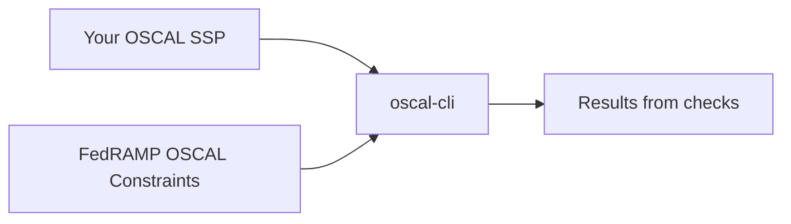

# FedRAMP OSCAL Constraints

## What are they?

FedRAMP's OSCAL Constraints are machine-readable checks to validate [one or more OSCAL documents](https://automate.fedramp.gov/documentation/general-concepts/oscal-file-concepts/) in a digital authorization package meet FedRAMP's requirements and recommendations to follow best practices.

To use these constraints, you must download software that supports processing FedRAMP OSCAL Constraints. The [`oscal-cli`](https://github.com/metaschema-framework/oscal-cli/) has the most comprehensive support for the constraint processing and necessary supporting functions. This document will guide you through different ways to install the software and necessary support files. It will also guide you through checking a document with OSCAL constraints, and analyze results to know if the file conforms with FedRAMP's guidelines or changes are necessary. Once you do so, you will increase your confidence in your submission of a digital authorization package before review by FedRAMP's automated systems or reviewers.

## Who should use FedRAMP OSCAL Constraints?

FedRAMP makes these constraints and tools for FedRAMP OSCAL implementers, practitioners, and content authors, including cloud service providers (CSPs), OSCAL tool suppliers, assessors, and federal agencies.

## What is `oscal-cli`?

OSCAL CLI is a Java-based tool for validating FedRAMP OSCAL documents. It ensures that your OSCAL content meets FedRAMP OSCAL requirements.

The tool
1. Validates your OSCAL content against existing FedRAMP OSCAL constraints.
2. Identifies areas, where your OSCAL content meets and does not meet FedRAMP OSCAL requirements.
3. Produces a SARIF report, containing details about passed and failed OSCAL content.

## Installation

There are multiple ways to install the constraints and the `oscal-cli` tool to check OSCAL documents with constraints. FedRAMP recommends you use [the Docker container engine](https://docs.docker.com/get-started/), or an alternative [OCI-conformant](https://opencontainers.org/) container runtime, to download the most recent version of the constraint files, `oscal-cli`, and their dependencies. Dockers allows you to download the software pre-compiled and pre-configured without additional manual steps.

## Recommended installation with containers

### Prerequisites

1. Install 

###

## Manual installation without containers for advanced users

This section provides instructions for setting up your local environment to run OSCAL CLI validations.

## Prerequisites

To use OSCAL CLI, you need the following programs:
1. *Windows only:* A Linux-like shell terminal (for example, MS Visual Studio Code, Windows Subsystem for Linux, MSYS2, Cygwin)
2. JDK version 11 or newer (you can download JDK from a variety of sources; for example, [https://adoptium.net/](https://adoptium.net/), [https://openjdk.org/](https://openjdk.org/), [https://www.oracle.com/java/technologies/downloads/](https://www.oracle.com/java/technologies/downloads/)) 
3. Git (any Git interface; for example, Git Bash, GitHub Desktop, Visual Studio Code, Oxygen Editor; for more information about Git, visit [https://git-scm.com/](https://git-scm.com/))

## Installing OSCAL CLI

To install OSCAL CLI
1. Go to [https://github.com/metaschema-framework/oscal-cli/releases](https://github.com/metaschema-framework/oscal-cli/releases).
2. Under the latest release, click **Download**.
3. Download the ZIP archive.
4. Open the Linux terminal.
5. If the **opt** directory does not exist in your shell structure, run the following commands:
   a. `cd /`
   b. `mkdir opt`
6. To navigate to the **opt** directory, run the following command:
   `cd opt`
7. To create the **oscal-cli** directory, run the following command:
   `mkdir oscal-cli`
8. To extract the downloaded ZIP archive into the created **oscal-cli** directory, run the following command:
   `unzip <oscal-cli-zip-file> -d /opt/oscal-cli`
   For example, if you downloaded the **oscal-cli-enhanced-2.0.2-oscal-cli.zip** file into your **Downloads** directory, run the following command:
   `unzip $USERPROFILE/Downloads/oscal-cli-enhanced-2.0.2-oscal-cli.zip -d /opt/oscal-cli`

## Adding Java and OSCAL CLI to the PATH variable

To add Java and OSCAL CLI to the shell’s **PATH** variable
1. Install JDK.
2. Using your preferred text editor, open the following file:
   `<shell-root>/home/<user>/.bashrc`
3. Scroll to the bottom of the file.
4. To add Java and OSCAL CLI to the PATH variable, insert the following lines, replacing **\<jdk-path\>** with the actual Java installation directory path on your system:
   `export PATH=$PATH:<jdk-path>/bin`
   `export PATH=$PATH:/opt/oscal-cli/bin`
5. Save and close the **.bashrc** file.
6. Open the Linux terminal.
7. To verify that Java is working correctly
   a. Run the following command:
      `java --version`
   b. Verify that the command returns the Java version.
8. To verify that OSCAL CLI is working correctly
   a. Run the following command:
      `oscal-cli --help`
   b. Verify that the command returns OSCAL CLI help.

For more information about installing OSCAL CLI, visit [https://github.com/metaschema-framework/oscal-cli?tab=readme-ov-file\#installing](https://github.com/metaschema-framework/oscal-cli?tab=readme-ov-file\#installing).

## Upgrading OSCAL CLI

To upgrade OSCAL CLI to a newer version
1. Go to [https://github.com/metaschema-framework/oscal-cli/releases](https://github.com/metaschema-framework/oscal-cli/releases).
2. Under the latest release, click **Download**.
3. Download the ZIP archive.
4. Open the Linux terminal.
5. To delete everything in the **/opt/oscal-cli** directory, run the following command:
   `rm -rf /opt/oscal-cli/*`
6. To extract the downloaded ZIP archive into the empty **oscal-cli** directory, run the following command:
   `unzip <oscal-cli-zip-file> -d /opt/oscal-cli` 
      For example, if you downloaded the **oscal-cli-enhanced-2.0.2-oscal-cli.zip** file into your **Downloads** directory, run the following command:
   `unzip $USERPROFILE/Downloads/oscal-cli-enhanced-2.0.2-oscal-cli.zip -d /opt/oscal-cli`
7. To verify that OSCAL CLI is working correctly
   a. Run the following command:
      `oscal-cli --help`
   b. Verify that the command returns OSCAL CLI help.

# Validating FedRAMP OSCAL content
This section describes steps for validating FedRAMP OSCAL artifacts (SSP, SAP, SAR, and POA\&M files).

## Cloning the FedRAMP Automation repository
To validate your FedRAMP OSCAL content, you need to clone the FedRAMP Automation GitHub repository, which contains tests for FedRAMP-specific OSCAL extensions.

To clone the FedRAMP Automation repository
1. Open the Linux terminal.
2. Navigate to the directory where you want to clone the repository.
3. Run the following command:
   `git clone --recurse-submodules https://github.com/GSA/fedramp-automation.git`

## Getting the latest repository updates

If you have previously cloned the FedRAMP Automation repository, to get the most recent changes
1. Open the Linux terminal.
2. To navigate to the cloned repository directory, run the following command, replacing **\<fedramp-automation-repository\>** with the actual path:
   `cd <fedramp-automation-repository>`
3. To switch to the **feature/external-constraints** branch, run the following command:
   `git checkout feature/external-constraints`
4. To verify that you are on the **feature/external-constraints** branch
   a. Run the following command:
      `git branch`
   b. Make sure that the **feature/external-constraints** branch is green.
5. To get the latest repository updates, run the following command:
   `git pull`

## Validating FedRAMP OSCAL files

To validate your FedRAMP OSCAL file, using the FedRAMP external constraints
1. Open the Linux terminal.
2. Run the following command:
   `oscal-cli validate <oscal-artifact> -c <fedramp-external-constraints> -o <sarif-output> --sarif-include-pass`
   where
	* `<oscal-artifact>`is your SSP, SAR, SAP, or POA\&M file
	* `<fedramp-external-constraints>` is the name of a FedRAMP external constraints file (for example, **fedramp-external-allowed-values.xml**; you may specify more than one file)
	* `<sarif-output>` is the name of a validation report file that the tool generates in the JSON-based SARIF format (for example, **report.sarif**; for more information about SARIF, visit [https://docs.oasis-open.org/sarif/sarif/v2.1.0/sarif-v2.1.0.html](https://docs.oasis-open.org/sarif/sarif/v2.1.0/sarif-v2.1.0.html))
	* `--sarif-include-pass` is the option to include passed validation results in the SARIF report (by default, the SARIF output includes only failed validations; if you want only the failed results, omit this option)

For example, run the following command:
`oscal-cli validate ssp.xml -c fedramp-external-allowed-values.xml -o ssp-validation-results.sarif --sarif-include-pass`

To view a complete list of
  * OSCAL CLI commands, run the following command:
     `oscal-cli --help`
  * Specific command options, run the following command:
     `oscal-cli <command> --help`

## Fixing validation errors

The tool generates validation reports in the JSON-based SARIF format. For more information about SARIF, visit [https://docs.oasis-open.org/sarif/sarif/v2.1.0/sarif-v2.1.0.html](https://docs.oasis-open.org/sarif/sarif/v2.1.0/sarif-v2.1.0.html).

If you prefer viewing SARIF reports in a GUI application, Visual Studio Code offers the **SARIF Viewer** extension. For more information, visit [https://marketplace.visualstudio.com/items?itemName=WDGIS.MicrosoftSarifViewer](https://marketplace.visualstudio.com/items?itemName=WDGIS.MicrosoftSarifViewer).

After validating your FedRAMP OSCAL file, to fix validation errors
1. Open the generated SARIF validation report file.
2. Search for **fail**.
3. In the **text** field for the failed validation, note the message (for example, `"The import-profile element must have a reference"`).
4. In the **decoratedName** field, note the XPath expression, which points to the location of the failed test in your OSCAL document (for example, `"/system-security-plan/metadata[1]"`).
5. Open the validated OSCAL file.
6. Find the location referenced in the **decoratedName** field.
7. Fix the error.
8. Re-run the validation.

# Providing feedback

If you encounter a bug or have a feature to request, submit an issue at [https://github.com/GSA/fedramp-automation/issues/new/choose](https://github.com/GSA/fedramp-automation/issues/new/choose).
