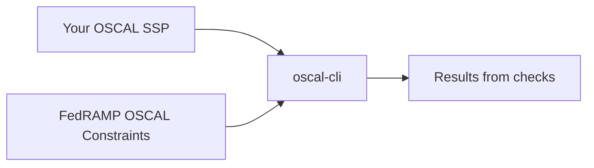

# FedRAMP OSCAL Constraints

## What are they?

FedRAMP's OSCAL Constraints are machine-readable checks to validate [one or more OSCAL documents](https://automate.fedramp.gov/documentation/general-concepts/oscal-file-concepts/) in a digital authorization package meet FedRAMP's requirements and recommendations to follow best practices.



To use these constraints, you must download software that supports processing FedRAMP OSCAL Constraints. The [`oscal-cli`](https://github.com/metaschema-framework/oscal-cli/) has the most comprehensive support for the constraint processing and necessary supporting functions. This document will guide you through different ways to install the software and necessary support files. It will also guide you through checking a document with OSCAL constraints, and analyze results to know if the file conforms with FedRAMP's guidelines or changes are necessary. Once you do so, you will increase your confidence in your submission of a digital authorization package before review by FedRAMP's automated systems or reviewers.

## Who should use FedRAMP OSCAL Constraints?

FedRAMP makes these constraints and tools for FedRAMP OSCAL implementers, practitioners, and content authors, including cloud service providers (CSPs), OSCAL tool suppliers, assessors, and federal agencies.

## What is `oscal-cli`?

The `oscal-cli` is a [command-line application](https://en.wikipedia.org/wiki/Command-line_interface) with important functionality for working with OSCAL documents. One important functionality is checking FedRAMP OSCAL documents. You can use the installed OSCAL models and FedRAMP's OSCAL Constraints to check your documents meet FedRAMP's requirements.

The tool

1. Validates your OSCAL content against existing FedRAMP OSCAL constraints.
2. Identifies areas, where your OSCAL content meets and does not meet FedRAMP OSCAL requirements.
3. Produces a SARIF report, containing details about passed and failed OSCAL content.

## Installation

There are multiple ways to install the constraints and the `oscal-cli` tool to check OSCAL documents with constraints. FedRAMP recommends you use [the Docker container engine](https://docs.docker.com/get-started/), or an alternative [OCI-conformant](https://opencontainers.org/) container runtime, to download the most recent version of the constraint files, `oscal-cli`, and their dependencies. Dockers allows you to download the software pre-compiled and pre-configured without additional manual steps.

## Recommended installation with containers

### Prerequisites

Install [Docker Desktop](https://www.docker.com/products/docker-desktop/) or [an alternative](https://hackernoon.com/5-docker-desktop-alternatives). (**NOTE:** This application, and popular alternatives, simplify the management of a container engine on your computer with a user-friendly interface. Although Docker Desktop is popular, FedRAMP cannot recommend or endorse one particular container management tool, and Docker Desktop's license [does not permit free use in many scenarios](https://docs.docker.com/subscription/desktop-license/), so you need to _may_ purchase a license. Vet Docker Desktop or any alternatives by reading the license and user reviews to make an informed choice. If you have an employer that manages a computer for you, contact the employer's IT staff, show them this documentation, and consult with them on the best software choice that complies with employer policy.)

### Installing the container image

1. Install [the necessary prerequisites](#prerequisites) for Docker or another OCI container engine.
2. Open a shell to run command-line applications on your computer.
   - For Windows, open the Start Menu and search for `powershell` to open PowerShell.
   - For macOS, open the search bar with the &#8984; and space bar to search for `terminal` to open Terminal.app with a `bash` or `zsh` session. (**NOTE:** The default has changed for different releases of macOS; both work with the FedRAMP tools and these shells are largely cross-compatible).
   - For Linux operating systems, there are many variations of terminal emulators. You need to open any terminal emulator to open a shell, `bash` or `zsh` will work with these tools.
3. Use the `docker` command-line utility to download the latest version of the container. (**NOTE**: The download may take from several seconds to several minutes depending on the speed of your connection.)

```bash
docker pull ghcr.io/gsa/fedramp-automation/validation-tools:latest
```

4. When the download is complete and the terminal prompts you for a new shell command, you can check that you correctly downloaded the image by running your first command to [verify the version of `oscal-cli` in the image].


### Upgrading the container image

1. Confirm that you still have [the necessary prerequisites](#prerequisites) for Docker or another OCI container engine installed.
1. Run the following command to upgrade to the latest released version of the container with the FedRAMP tools.

```bash
docker pull ghcr.io/gsa/fedramp-automation/validation-tools:latest
```

When you use `docker run ... ghcr.io/gsa/fedramp-automation/validation-tools:latest` on your computer, it will use the new version pinned to the `latest` tag that you recently downloaded instead of the previous version.


### Test the container image with your first command

After you [downloaded the image](#download-the-container-image), you can run your first container command to check the version is correct.

```bash
docker run -it --rm ghcr.io/gsa/fedramp-automation/validation-tools:latest --version
```

The command above runs the pre-installed and pre-configured release of `oscal-cli` within the container with the command `oscal-cli --version`. If successful, you will see output like the following.

```sh
oscal-cli 2.0.2 built at 2024-08-20 13:19 from branch 7df9154fb123ed6515ea51bacc65b7489da82717 (7df9154) at https://github.com/metaschema-framework/oscal-cli
liboscal-java  built at 2024-08-20 04:25 from branch 827cfe5b63f0f1f4905fc82c76d7e68733fcd271 (827cfe5) at https://github.com/metaschema-framework/liboscal-java
oscal v1.1.2 built at 2024-08-20 04:25 from branch 4f02dac6f698efda387cc5f55bc99581eaf494b6 (4f02dac) at https://github.com/usnistgov/OSCAL.git
metaschema-java 1.0.2 built at 2024-08-19T18:05:06+0000 from branch 76fe3c9dcebe45223d83034f4836510e3a347ba7 (76fe3c9) at https://github.com/metaschema-framework/metaschema-java
metaschema  built at 2024-08-19T18:05:06+0000 from branch 894b2238764c8732623a3894f0c236625ca5a686 (894b223) at https://github.com/metaschema-framework/metaschema.git
```

## Manual installation without containers for advanced users

This section provides instructions for setting up your local environment to run `oscal-cli` validations.

### Prerequisites

To use `oscal-cli`, you need the following programs:
1. *Windows only:* A Linux-like shell terminal (for example, MS Visual Studio Code, Windows Subsystem for Linux, MSYS2, Cygwin)
2. JDK version 11 or newer (you can download JDK from a variety of sources; for example, [https://adoptium.net/](https://adoptium.net/), [https://openjdk.org/](https://openjdk.org/), [https://www.oracle.com/java/technologies/downloads/](https://www.oracle.com/java/technologies/downloads/)) 
3. Git (any Git interface; for example, Git Bash, GitHub Desktop, Visual Studio Code, Oxygen Editor; for more information about Git, visit [https://git-scm.com/](https://git-scm.com/))

### Installing `oscal-cli`

To install `oscal-cli`
1. Go to [https://github.com/metaschema-framework/oscal-cli/releases](https://github.com/metaschema-framework/oscal-cli/releases).
2. Under the latest release, click **Download**.
3. Download the ZIP archive.
4. Open the Linux terminal.
5. If the **opt** directory does not exist in your shell structure, run the following commands:
   a. `cd /`
   b. `mkdir opt`
6. To navigate to the **opt** directory, run the following command:
   `cd opt`
7. To create the **oscal-cli** directory, run the following command:
   `mkdir oscal-cli`
8. To extract the downloaded ZIP archive into the created **oscal-cli** directory, run the following command:
   `unzip <oscal-cli-zip-file> -d /opt/oscal-cli`
   For example, if you downloaded the **oscal-cli-enhanced-2.0.2-oscal-cli.zip** file into your **Downloads** directory, run the following command:
   `unzip $USERPROFILE/Downloads/oscal-cli-enhanced-2.0.2-oscal-cli.zip -d /opt/oscal-cli`

### Adding Java and `oscal-cli` to the PATH variable

To add Java and `oscal-cli` to the shell’s **PATH** variable
1. Install JDK.
2. Using your preferred text editor, open the following file:
   `<shell-root>/home/<user>/.bashrc`. Alternatively, you may not have a .bashrc file, in which case you should open your `.bash_profile` file. 
3. Scroll to the bottom of the file.
4. To add Java and `oscal-cli` to the PATH variable, insert the following lines, replacing **\<jdk-path\>** with the actual Java installation directory path on your system:
   `export PATH=$PATH:<jdk-path>/bin`
   `export PATH=$PATH:/opt/oscal-cli/bin`
5. Save and close the **.bashrc** file.
6. Open the Linux terminal.
7. To verify that Java is working correctly
   a. Run the following command:
      `java --version`
   b. Verify that the command returns the Java version.
8. To verify that `oscal-cli` is working correctly
   a. Run the following command:
      `oscal-cli --help`
   b. Verify that the command returns `oscal-cli` help.

For more information about installing `oscal-cli`, visit [https://github.com/metaschema-framework/oscal-cli?tab=readme-ov-file\#installing](https://github.com/metaschema-framework/oscal-cli?tab=readme-ov-file\#installing).

### Upgrading `oscal-cli`

To upgrade `oscal-cli` to a newer version
1. Go to [https://github.com/metaschema-framework/oscal-cli/releases](https://github.com/metaschema-framework/oscal-cli/releases).
2. Under the latest release, click **Download**.
3. Download the ZIP archive.
4. Open the Linux terminal.
5. To delete everything in the **/opt/oscal-cli** directory, run the following command:
   `rm -rf /opt/oscal-cli/*`
6. To extract the downloaded ZIP archive into the empty **oscal-cli** directory, run the following command:
   `unzip <oscal-cli-zip-file> -d /opt/oscal-cli` 
      For example, if you downloaded the **oscal-cli-enhanced-2.0.2-oscal-cli.zip** file into your **Downloads** directory, run the following command:
   `unzip $USERPROFILE/Downloads/oscal-cli-enhanced-2.0.2-oscal-cli.zip -d /opt/oscal-cli`
7. To verify that `oscal-cli` is working correctly
   a. Run the following command:
      `oscal-cli --help`
   b. Verify that the command returns `oscal-cli` help.

## Cloning the FedRAMP Automation repository

To validate your FedRAMP OSCAL content, you need to clone the FedRAMP Automation GitHub repository, which contains tests for FedRAMP-specific OSCAL extensions.

To clone the FedRAMP Automation repository
1. Open the Linux terminal.
2. Navigate to the directory where you want to clone the repository.
3. Run the following command:
   `git clone --recurse-submodules https://github.com/GSA/fedramp-automation.git`

## Getting the latest repository updates

If you have previously cloned the FedRAMP Automation repository, to get the most recent changes
1. Open the Linux terminal.
2. To navigate to the cloned repository directory, run the following command, replacing **\<fedramp-automation-repository\>** with the actual path:
   `cd <fedramp-automation-repository>`
3. To switch to the **feature/external-constraints** branch, run the following command:
   `git checkout feature/external-constraints`
4. To verify that you are on the **feature/external-constraints** branch
   a. Run the following command:
      `git branch`
   b. Make sure that the **feature/external-constraints** branch is green.
5. To get the latest repository updates, run the following command:
   `git pull`

# Validating FedRAMP OSCAL content

This section describes steps for validating FedRAMP OSCAL artifacts (SSP, SAP, SAR, and POA\&M files).

## Understanding the `oscal-cli validate` subcommand

To validate your FedRAMP OSCAL file, you run the oscal-cli via the [the container image](#installing-the-container-image) or directly with [the manual install on your computer](#manual-installation-without-containers-for-advanced-users) with the following arguments.

For the container-based install, the command will resemble the following.

```bash
docker run -it --rm -v <host-oscal-artifact-directory>:/data ghcr.io/gsa/fedramp-automation/validation-tools:latest validate <oscal-artifact> -c <fedramp-external-constraints> -o <sarif-output> --sarif-include-pass
```

For the manual install, the command will resemble the following.

```bash
oscal-cli validate <oscal-artifact> -c <fedramp-external-constraints> -o <sarif-output> --sarif-include-pass
```

   where
	* `<oscal-artifact>`is your SSP, SAR, SAP, or POA\&M file
	* `<fedramp-external-constraints>` is the name of a FedRAMP external constraints file (for example, **fedramp-external-allowed-values.xml**; you may specify more than one file)
	* `<sarif-output>` is the name of a validation report file that the tool generates in the JSON-based SARIF format (for example, **report.sarif**; for more information about SARIF, visit [https://docs.oasis-open.org/sarif/sarif/v2.1.0/sarif-v2.1.0.html](https://docs.oasis-open.org/sarif/sarif/v2.1.0/sarif-v2.1.0.html))
	* `--sarif-include-pass` is the option to include passed validation results in the SARIF report (by default, the SARIF output includes only failed validations; if you want only the failed results, omit this option)
   * <host-oscal-artifact-directory> is *only* for use with the container. It is the directory where store your FedRAMP OSCAL files on the computer. Inside the container, those files are mounted in the `/data` directory, so you will reference the files' location there when using the container.

## Validation command examples

For example, you can run the following command a container with the FedRAMP OSCAL Constraints, opening a [terminal](#installing-the-container-image), mounting your current folder with a volume mount, and running the `oscal-cli` from within a container.

### Running example commands in the container

For this example, if you have a computer with the Windows operating system, run the following command with Powershell.

```powershell
docker run -it --rm -v ${PWD}:/data ghcr.io/gsa/fedramp-automation/validation-tools:latest validate /data/ssp.xml -c fedramp-external-allowed-values.xml -o /data/ssp-validation-results.sarif --sarif-include-pass
```

For this example, if you have a computer with macOS or Linux operating systems, run the following command with Powershell.

```powershell
docker run -it --rm -v $(pwd):/data ghcr.io/gsa/fedramp-automation/validation-tools:latest validate /data/ssp.xml -c fedramp-external-allowed-values.xml -o /data/ssp-validation-results.sarif --sarif-include-pass
```

In these examples, you used the `oscal-cli` to validate your own SSP in your current directory and write out the results into a SARIF file in the same folder on your computer thanks to volume mount.

### Running example commands with a manual installation

For example, run the following command with a manual install:
`oscal-cli validate ssp.xml -c fedramp-external-allowed-values.xml -o ssp-validation-results.sarif --sarif-include-pass`

To view a complete list of
  * `oscal-cli` commands, run the following command:
     `oscal-cli --help`
  * Specific command options, run the following command:
     `oscal-cli <command> --help`

## Fixing validation errors

The tool generates validation reports in the JSON-based SARIF format. For more information about SARIF, visit [https://docs.oasis-open.org/sarif/sarif/v2.1.0/sarif-v2.1.0.html](https://docs.oasis-open.org/sarif/sarif/v2.1.0/sarif-v2.1.0.html).

If you prefer viewing SARIF reports in a GUI application, Visual Studio Code offers the **SARIF Viewer** extension. For more information, visit [https://marketplace.visualstudio.com/items?itemName=WDGIS.MicrosoftSarifViewer](https://marketplace.visualstudio.com/items?itemName=WDGIS.MicrosoftSarifViewer).

After validating your FedRAMP OSCAL file, to fix validation errors
1. Open the generated SARIF validation report file.
2. Search for **fail**.
3. In the **text** field for the failed validation, note the message (for example, `"The import-profile element must have a reference"`).
4. In the **decoratedName** field, note the XPath expression, which points to the location of the failed test in your OSCAL document (for example, `"/system-security-plan/metadata[1]"`).
5. Open the validated OSCAL file.
6. Find the location referenced in the **decoratedName** field.
7. Fix the error.
8. Re-run the validation.

# Troubleshooting

## Errors versus unexpected failures

When using the `oscal-cli`, you may encounter errors or unexpected failures.

## Debugging details of errors

When the `oscal-cli` has an error condition, it will continue processing, but also return output to recommend how a user of the tool must change the runtime arguments or edit the OSCAL content to resolve the underlying issue. An example is below.

```sh
% docker run --rm -it \
   -v $(PWD):/data ghcr.io/gsa/fedramp-automation/validation-tools \
   validate '/data/AwesomeCloudSSP1.xml'
Validating 'file:/data/AwesomeCloudSSP1.xml' as XML.
Validation identified the following issues:
[ERROR] # ... Truncated for brevity
```

In this example, the tool finished processing an OSCAL document and validated it. Despite the tool completing successfully, it did find issues in the content the user should know and possibly correct. These issues are only errors; this output does not state a more serious unexpected failure occurred. Errors are different from unexpected failures, which require more information to get more help.

## Debugging details of unexpected failures with `--show-stack-trace`

When the `oscal-cli` has an unexpected error condition, the tool must stop processing because it cannot recover. An unexpected error, or an exception, can return detailed technical output for tool maintainers to guide users on how to change runtime arguments or content to resolve the issue. By default, the `oscal-cli` does not show all of the information from an expected error. It will instead show a summary, such as the example below.

```sh
docker run --rm -it \
   -v $(PWD):/data ghcr.io/gsa/fedramp-automation/validation-tools \
   validate '/data/AwesomeCloudSSP1.xml'
Validating 'file:/data/AwesomeCloudSSP1.xml' as XML.
Unexpected failure during validation of 'file:/data/AwesomeCloudSSP1.xml'
```

When the tool reports an unexpected failure, you can rerun the `oscal-cli` tool with a new command to see full details using the stack trace command. An example is below.

```sh
docker run --rm -it \
   -v $(PWD):/data ghcr.io/gsa/fedramp-automation/validation-tools \
   validate '/data/AwesomeCloudSSP1.xml' \
   --show-stack-trace
Validating 'file:/data/AwesomeCloudSSP1.xml' as XML.
Unexpected failure during validation of 'file:/data/AwesomeCloudSSP1.xml'
java.io.IOException: Unexpected failure during validation of 'file:/data/AwesomeCloudSSP1.xml'
	at gov.nist.secauto.metaschema.core.model.validation.XmlSchemaContentValidator.validate(XmlSchemaContentValidator.java:92) ~[dev.metaschema.java.metaschema-core-1.0.2.jar:?]
	at gov.nist.secauto.metaschema.core.model.validation.AbstractContentValidator.validate(AbstractContentValidator.java:27) ~[dev.metaschema.java.metaschema-core-1.0.2.jar:?]
	at gov.nist.secauto.metaschema.databind.IBindingContext$ISchemaValidationProvider.validateWithSchema(IBindingContext.java:473) ~[dev.metaschema.java.metaschema-databind-1.0.2.jar:?]
	at gov.nist.secauto.metaschema.cli.commands.AbstractValidateContentCommand$AbstractValidationCommandExecutor.execute(AbstractValidateContentCommand.java:250) ~[dev.metaschema.java.metaschema-cli-1.0.2.jar:?]
	at gov.nist.secauto.metaschema.cli.processor.CLIProcessor$CallingContext.invokeCommand(CLIProcessor.java:405) ~[dev.metaschema.java.cli-processor-1.0.2.jar:?]
	at gov.nist.secauto.metaschema.cli.processor.CLIProcessor$CallingContext.processCommand(CLIProcessor.java:376) [dev.metaschema.java.cli-processor-1.0.2.jar:?]
	at gov.nist.secauto.metaschema.cli.processor.CLIProcessor.parseCommand(CLIProcessor.java:175) [dev.metaschema.java.cli-processor-1.0.2.jar:?]
	at gov.nist.secauto.metaschema.cli.processor.CLIProcessor.process(CLIProcessor.java:158) [dev.metaschema.java.cli-processor-1.0.2.jar:?]
	at gov.nist.secauto.oscal.tools.cli.core.CLI.runCli(CLI.java:67) [dev.metaschema.oscal.oscal-cli-enhanced-2.0.2.jar:?]
	at gov.nist.secauto.oscal.tools.cli.core.CLI.main(CLI.java:38) [dev.metaschema.oscal.oscal-cli-enhanced-2.0.2.jar:?]
Caused by: org.xml.sax.SAXParseException: The entity name must immediately follow the '&' in the entity reference.
	at java.xml/com.sun.org.apache.xerces.internal.jaxp.validation.Util.toSAXParseException(Util.java:75) ~[?:?]
	at java.xml/com.sun.org.apache.xerces.internal.jaxp.validation.StreamValidatorHelper.validate(StreamValidatorHelper.java:178) ~[?:?]
	at java.xml/com.sun.org.apache.xerces.internal.jaxp.validation.ValidatorImpl.validate(ValidatorImpl.java:115) ~[?:?]
	at java.xml/javax.xml.validation.Validator.validate(Validator.java:124) ~[?:?]
	at gov.nist.secauto.metaschema.core.model.validation.XmlSchemaContentValidator.validate(XmlSchemaContentValidator.java:90) ~[dev.metaschema.java.metaschema-core-1.0.2.jar:?]
	... 9 more
```

This stack trace identifies a problem with the lower-level processing of OSCAL XML content.

## Analyzing and understanding stack traces

Developers use stack traces in their software to identify the order of execution and the error condition. The information helps confirm intended functionality or verify bugs that they must fix. Developer or not, you too can use this information to resolve your own issues with the `oscal-cli`, the FedRAMP constraints, and your content. With the information in a stack trace, you can do the following.

1. Search [the developer documentation on unexpected failures](./CONTRIBUTING.md#common-causes-and-resolutions-for-unexpected-failures) and how to resolve them.
1. Copy paste part or whole of the exception output into a search engine to identify and resolve common causes of the error.
1. Use a chatbot or tooling with Large Language Models (LLM) functionality to explain, identify, and resolve common causes of the error.

If 1, 2, or 3 do not help you identify and resolve your issue yourself, we strongly encourage you to engage the FedRAMP Automation Team and [provide feedback](#providing-feedback).

**NOTE:** If you are a member of an organization, please consult your organization's staff and their policies for approved tools when attempting 2 or 3.

## Asking good questions

If you need help after trying to debug, you should [ask for help or report your issue](#providing-feedback). When you do that, it is really helpful to include debugging information so the FedRAMP Automation Team can reproduce your issue and give you the exact help you need. You should include the following.

1. Version information about the constraints and tools you used.
1. If acceptable, any sample OSCAL data you used when the error or unexpected failure occurred.
1. What you have tried, what did not work, and how you wanted it to work.

For 1, see below for more information about the versions of constraints and tools you use.

**NOTE:** The FedRAMP Automation Team always welcomes when contributors provide sample data to reproduce an error or unexpected failure, but do not provide any production for a system. In addition, GSA does not authorize FedRAMP staff or community members to store any sensitive data in GitHub. Please coordinate with the team to build an equivalent minimally viable example if requested to do so.

### Container version information

If you are using the container-based tooling, you only need to include the container version information. You can find that information by running the following command and copy-pasting the output.

```sh
docker image ls ghcr.io/gsa/fedramp-automation/validation-tools
```

You should see output like the example below, you can copy-paste this into the other details box of the issue template.

```sh
REPOSITORY                                       TAG         IMAGE ID      CREATED     SIZE
ghcr.io/gsa/fedramp-automation/validation-tools  latest      d6f1a0a22474  3 days ago  561 MB
```

### Manual install version information

If you are using the manually installed tooling, you only need to include a few items of information. You can find that information by running the following commands and copy-pasting the output.

1. Provide the commit ID for the git repository.

```sh
cd path/to/fedramp-automation
git branch --show-current
develop
git rev-parse HEAD
35b66c9da08ee125a3366000f9c36a0e74808c9c
```

2. Provide the version information for oscal-js.

```sh
cd path/to/fedramp-automation/src/validations/constraints
make init
npx oscal --version
1.4.7
```

3. Provide the version information for oscal-cli.

```sh
$(npm config get prefix)/bin/oscal-cli --version 
oscal-cli 2.1.0 built at 2024-09-16 15:20 from branch 3bf0b77e0dbfbe61988d2635439f691334840e35 (3bf0b77) at https://github.com/metaschema-framework/oscal-cli
liboscal-java  built at 2024-09-15 17:40 from branch b509fb2c5d933894cef5cd308603784d4494826f (b509fb2) at https://github.com/metaschema-framework/liboscal-java
oscal v1.1.2 built at 2024-09-15 17:40 from branch 4f02dac6f698efda387cc5f55bc99581eaf494b6 (4f02dac) at https://github.com/usnistgov/OSCAL.git
metaschema-java 1.1.0 built at 2024-09-14T12:53:54+0000 from branch 874ad2d8d561f9c481208bdf389788313bda343a (874ad2d) at https://github.com/metaschema-framework/metaschema-java
metaschema  built at 2024-09-14T12:53:54+0000 from branch 894b2238764c8732623a3894f0c236625ca5a686 (894b223) at https://github.com/metaschema-framework/metaschema.git
```

# Providing feedback

If you encounter a bug or have a feature to request, submit an issue at [https://github.com/GSA/fedramp-automation/issues/new/choose](https://github.com/GSA/fedramp-automation/issues/new/choose).

If you encounter a problem specific to the constraints and tooling described above, you should add information about the constraints and tool versions you used to ask for help, report bugs, or request new features in the other details section of the issue template.
